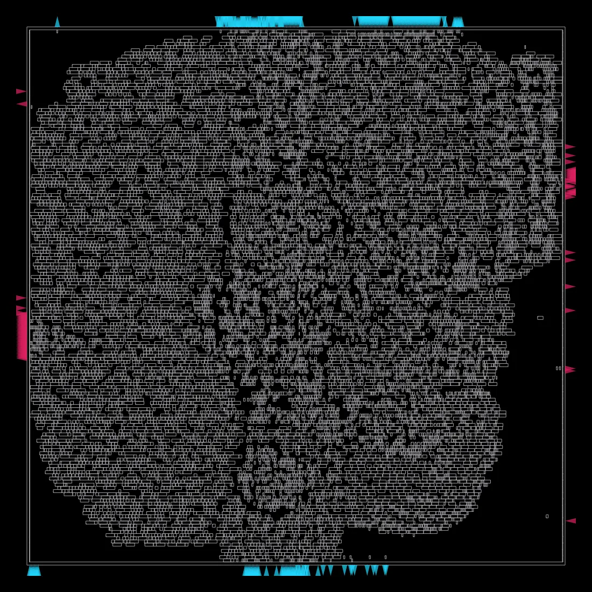
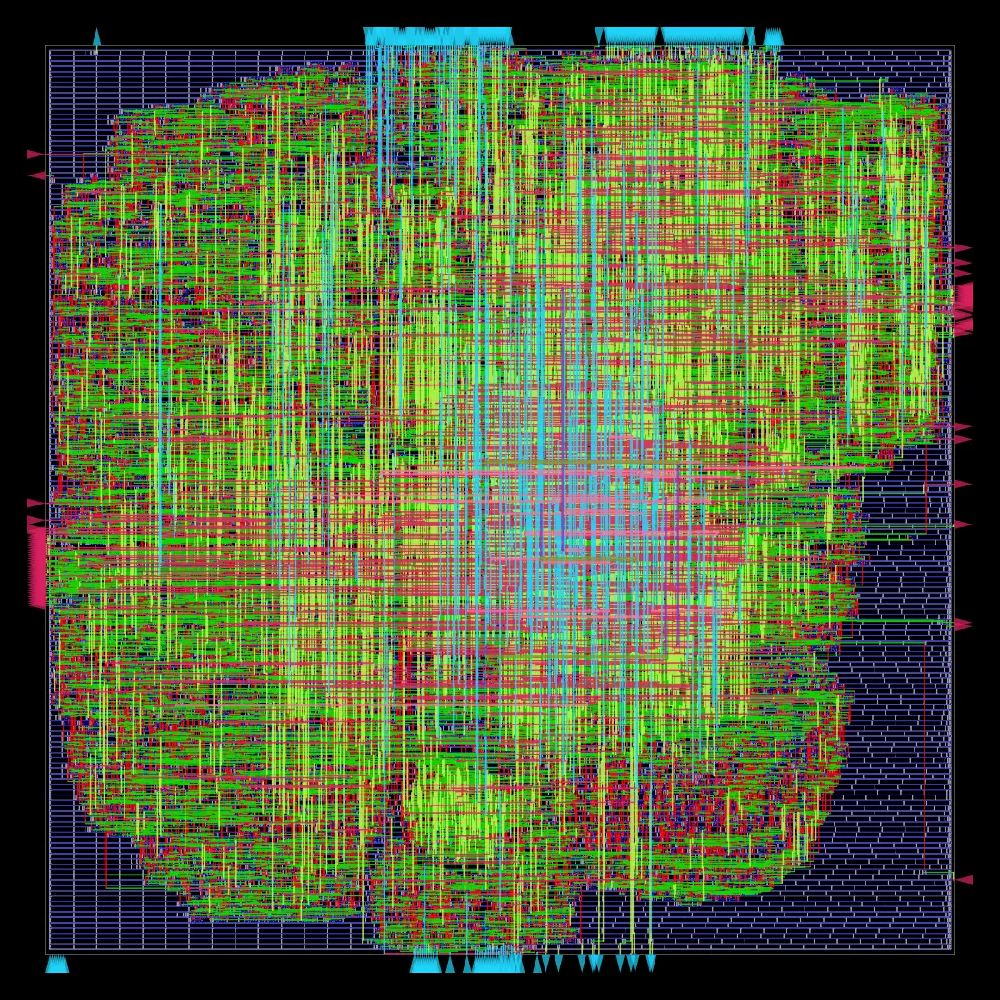
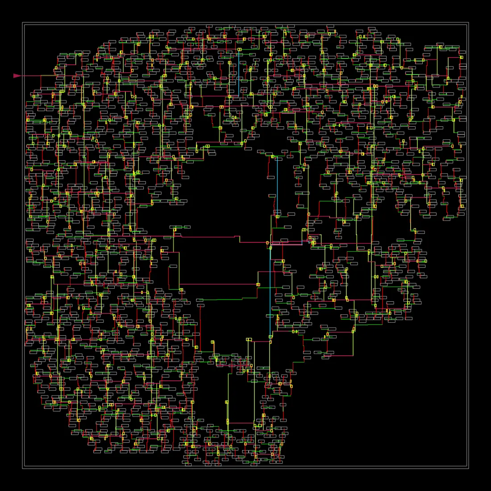
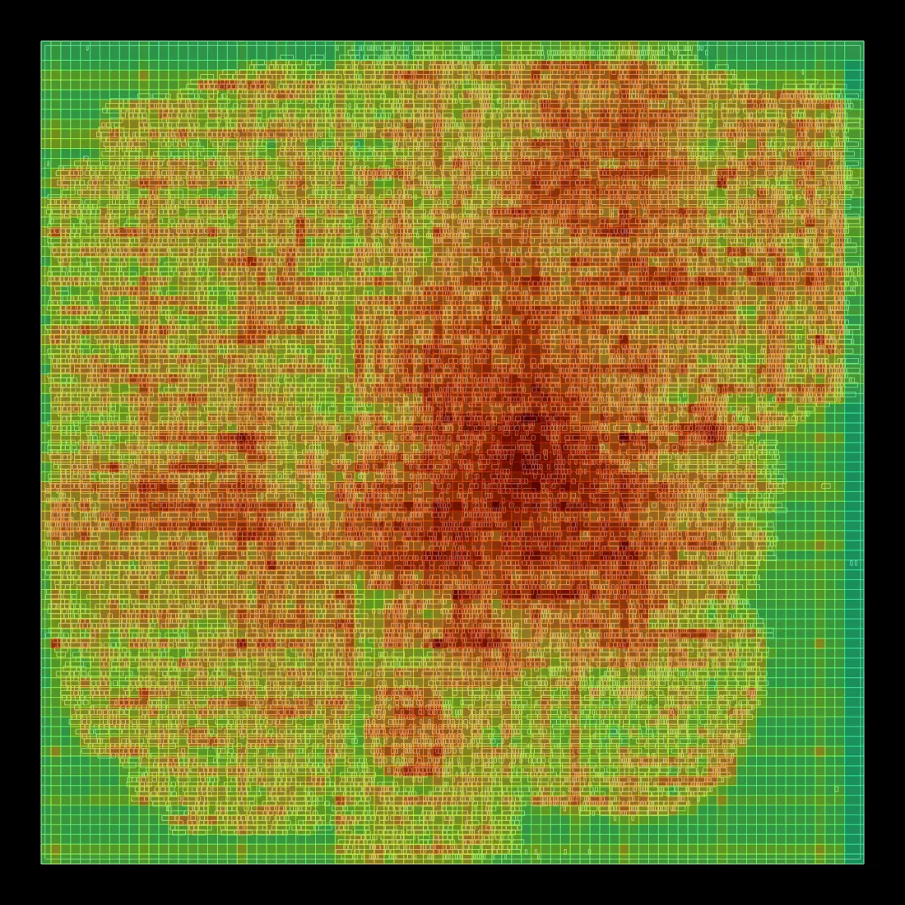
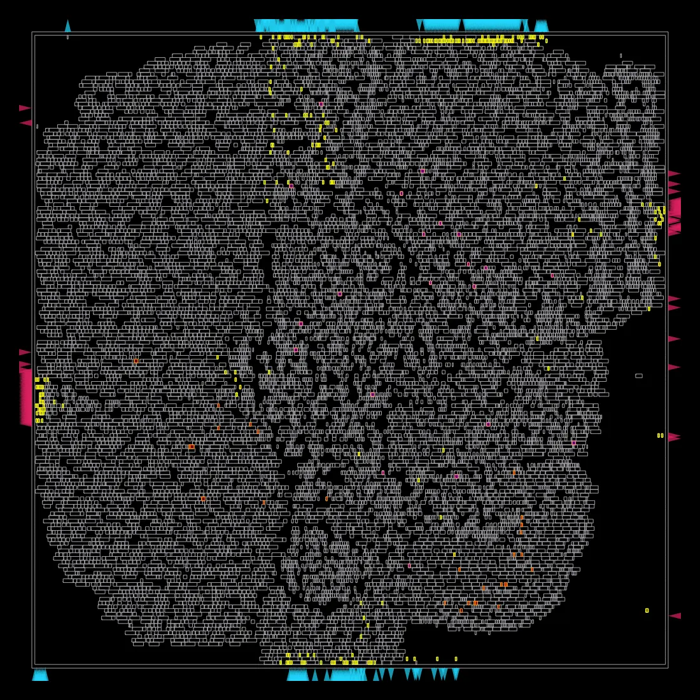
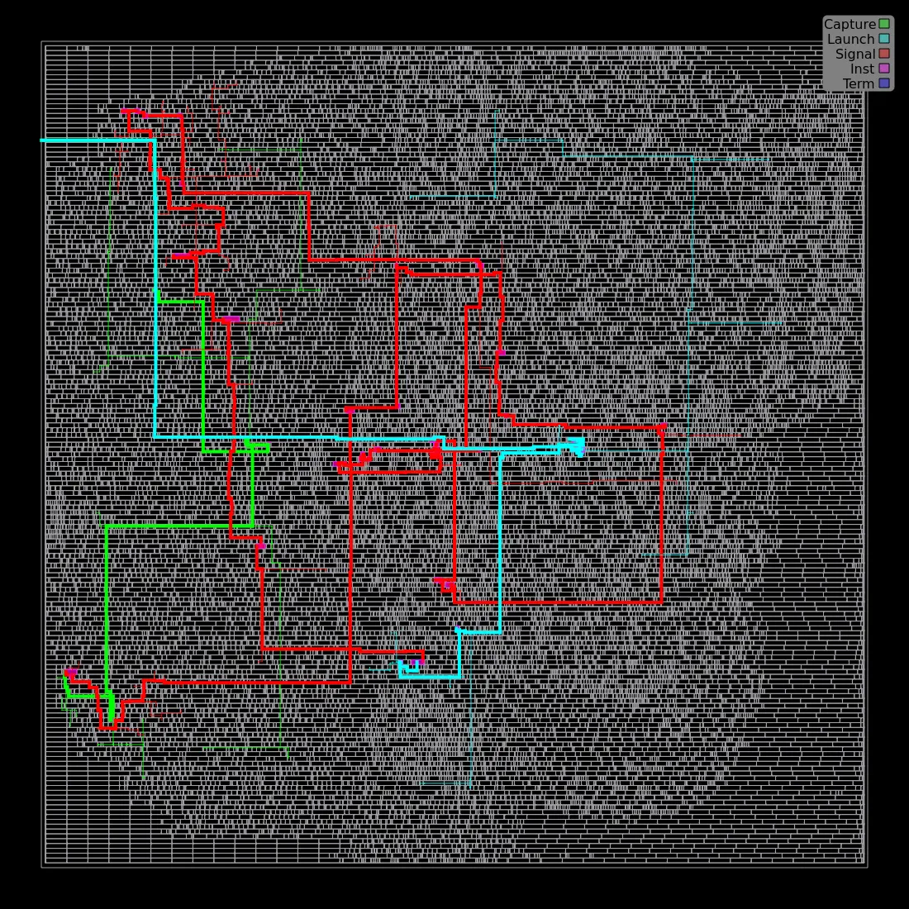

# ibex_core — Timing Closure via Interactive ECO


-lightgrey)

A real RISC-V CPU core ([lowRISC ibex](https://github.com/lowRISC/ibex)) taken through the full
[OpenROAD-flow-scripts](https://github.com/The-OpenROAD-Project/OpenROAD-flow-scripts) (ORFS)
RTL-to-GDSII flow, diagnosed for a real setup-timing violation left by its shipped constraint,
then closed via a hands-on interactive ECO (engineering change order) session — reading the
critical path gate-by-gate, manually resizing the bottleneck cell, then confirming closure with
OpenROAD's automated `repair_timing` pass.

This is a companion / scale-up project to [`gcd-rtl-to-gdsii`](../gcd-rtl-to-gdsii) — same
toolchain and PDK, but a 30x larger, hand-written real CPU instead of a small textbook design.

---

## TL;DR

| | |
|---|---|
| **Design** | `ibex_core` — lowRISC's production RV32IMC RISC-V core (real hand-written SystemVerilog) |
| **PDK** | Nangate45 (open, synthetic 45nm-class library) |
| **Scale** | 31,761 instances, 57,255 µm² die area, 15,321 std cells |
| **Baseline result (shipped constraint)** | WNS **-15.5 ps**, TNS -1.37 ns, **240 setup violations**, 0 hold violations — a "near-miss" constraint at CPU scale |
| **What this project does** | Diagnoses the exact bottleneck cell on the worst path, fixes it two ways (manual `replace_cell`, then automated `repair_timing`), and honestly documents where full physical re-closure hit a real tooling limitation |
| **Key result** | All **240 setup violations closed**, WNS **-15.5 ps → +5 ps**, via an 8-cell resize + 2-pin-swap ECO — verified at the STA level |

---

## Why This Project Exists

Most "hello world" physical design exercises stop at "the flow ran and produced a GDS." The more
useful — and more realistic — skill is what happens when the flow finishes with *violations*:
how do you find the actual cause, and what are the real options for fixing it? This project
picks up exactly where [`gcd-rtl-to-gdsii`](../gcd-rtl-to-gdsii) left off (a shipped constraint
that missed by picoseconds across hundreds of paths at CPU scale) and works the problem the way
a physical design/PPA engineer actually would: read the timing report, find the weak cell,
fix it, verify, and know the limits of what you just did.

---

## The Design

`ibex_core` is [lowRISC's Ibex](https://github.com/lowRISC/ibex) — a production, silicon-proven
2-stage RV32IMC RISC-V core used in real tapeouts (e.g. OpenTitan). Unlike a PyMTL-generated
teaching example, this is real, hand-written SystemVerilog: register file, ALU, decoder,
multiplier/divider, prefetch buffer, CSRs, and full pipeline control — synthesized here with
Yosys's `slang` frontend (no separate SystemVerilog-to-Verilog conversion needed).

RTL is not vendored into this repo (it's a large, actively-maintained upstream project — see
[Acknowledgments](#acknowledgments--license)); only this project's own config/constraints/reports
are included.

---

## Baseline: A Near-Miss Constraint at CPU Scale

The shipped `clk_period = 2.2 ns` (≈454 MHz) constraint was *nearly* correct — a sharp contrast
to `gcd`'s first attempt, which was wildly unrealistic (missed by 160 ps on a single dominant
path). At ibex's scale, "almost right" looks different:

| Metric | Value |
|---|---|
| WNS | **-0.02 ns** (-15.5 ps by the flow's own metric) |
| TNS | -1.37 ns |
| Setup violations | **240** (tiny individual slacks) |
| Hold violations | 0 |
| Achieved fmax | ~451 MHz (core_clock) |
| Total power | 22.1 mW |

Full curated report: [`reports/baseline_6_finish_curated.rpt`](reports/baseline_6_finish_curated.rpt) ·
machine-readable metrics: [`reports/ibex_baseline_2.20ns_metrics.json`](reports/ibex_baseline_2.20ns_metrics.json) ·
config: [`config/config.mk`](config/config.mk) · SDC: [`constraints/constraint_2.20ns_shipped.sdc`](constraints/constraint_2.20ns_shipped.sdc)

240 violations sounds alarming next to `gcd`'s 51, but the individual slacks are tiny — this is
what "almost closed" looks like once a design has hundreds of thousands of timing paths instead
of a few hundred.

---

## Diagnosing the Worst Path

Reopened the finished, routed design interactively (`make ... gui_final`) and pulled the exact
worst path with OpenSTA:

```tcl
report_checks -path_delay max -to {gen_regfile_ff.register_file_i.rf_reg[948]$_DFFE_PN0P_/D} -fields {slew cap input}
```

```
Startpoint: if_stage_i.instr_rdata_id_o[15]  (launch flip-flop)
Endpoint:   gen_regfile_ff.register_file_i.rf_reg[948]/D  (register file write port)
~30 logic gates deep · arrival 2.42 ns · required 2.40 ns
slack = -0.02 ns  (VIOLATED)
```

**Reading Cap/Slew, not just Delay:** every cell's report line carries `Cap` (total capacitive
load it drives — wire + fanout pin caps) and `Slew` (how sharp its output transition is). Gate
delay is fundamentally an RC time constant (`delay ≈ R_driver × C_load`), so comparing a cell's
Cap/Slew against same-type neighbors on the same path exposes anything mis-sized for its load,
without needing a fixed threshold:

```
Cap    Slew   Delay   Cell (all MUX2_X1, same driver strength)
2.90   0.01   0.06    _17633_/Z
32.48  0.04   0.10    _17634_/Z   <- ~11x the load of its neighbor, same drive strength
3.34   0.01   0.07    _18610_/Z   <- inherits the degraded edge from above
```

`_17634_` was the outlier: driving ~11x its neighbors' capacitive load while still at the
smallest available drive strength (`X1`). Full path and methodology:
[`reports/eco_session_log.md`](reports/eco_session_log.md).

---

## Closing It: Two ECO Techniques

### 1. Manual cell resize (surgical, one cell)

```tcl
replace_cell _17634_ MUX2_X2
```

Slack improved -0.02 → -0.01 ns — but the critical path *moved* to a different, previously
second-place startpoint converging on the same shared logic (a whack-a-mole result common when
many paths cluster near the same slack). Traced both paths to a shared OR-tree tail already at
its largest available drive strength (`OR4_X4` — confirmed no bigger variant exists in the
nangate45 library) — manual sizing had hit a real structural ceiling.

### 2. Automated ECO — `repair_timing`

```tcl
repair_timing -setup
```

```
[INFO RSZ-0094] Found 240 endpoints with setup violations.
[INFO RSZ-0099] Repairing 240 out of 240 (100.00%) violating endpoints...
[INFO RSZ-0051] Resized 8 instances: 8 up, 0 up match, 0 down, 0 VT
[INFO RSZ-0043] Swapped pins on 2 instances.
```

| Metric | Before ECO | After ECO |
|---|---|---|
| WNS | -0.015 ns | **+0.005 ns** |
| Setup violations | 240 | **0** |
| Cells touched | — | 8 resized, 2 pin swaps (out of 15,321 std cells) |

An 8-cell, surgical change closed all 240 violations — including via a technique manual sizing
alone hadn't reached: `SwapPinsMove`, which reassigns which logical input lands on a gate's
faster physical input pin (some cells like AOI/OAI have asymmetric input-to-output delays),
buying timing at zero area cost.

Full transcript: [`reports/eco_session_log.md`](reports/eco_session_log.md)

---

## What Full Signoff Closure Would Still Require (Honest Scope)

The ECO above is **verified at the STA level** inside the interactive session, but it was never
written back to the on-disk `.odb`. Making it a true signoff-clean result requires:

1. **Legalize placement** — resized cells are physically wider; ✅ done (`remove_fillers` →
   `detailed_placement`, converged clean, 0 violations, 3.9 µm max displacement)
2. **Re-route** the handful of nets touched by moved cells — ❌ attempted, hit a real limitation:
   a from-scratch whole-chip `global_route`/`detailed_route` (rather than a true *incremental*
   ECO reroute) produced genuinely disconnected nets (`DRT-0206 checkConnectivity error`) — not
   just DRC noise, an actually broken result. Diagnosed as an interactive full-reroute-after-
   legalization inconsistency, not a flaw in the resize/repair itself.
3. **Re-extract parasitics** and re-confirm final STA — not reached, blocked by step 2.

**This was a deliberate stopping point, not an unresolved bug** — the honest next step is
`detailed_route -incremental`, or driving the reroute through ORFS's own route-stage script
rather than bare interactive Tcl calls. Full transcript of the attempt and failure:
[`reports/eco_session_log.md`](reports/eco_session_log.md).

---

## Visual Outputs

Real OpenROAD renders from this project's `ibex_core` run (ORFS generates these automatically
running headless), not illustrations.

| Placement | Fully routed |
|---|---|
|  |  |
| 15,321 standard cells snapped into rows across 57,255 µm². | Every net wired across 10 metal layers. |

| Clock tree | Routing congestion |
|---|---|
|  |  |
| Balanced buffer tree feeding 1,938 sequential cells, ~0.07 ns setup skew. | Green = free routing tracks, red = crowded. |

| Post-repair resizing | Worst path (this project's focus) |
|---|---|
|  |  |
| Cells touched by ORFS's own timing-repair pass during the original flow run. | OpenROAD's rendering of the exact critical path diagnosed and fixed above. |

---

## Repository Structure

```
.
├── README.md
├── LICENSE
├── NOTICE.md
├── config/
│   └── config.mk                              # ORFS design config (nangate45/ibex)
├── constraints/
│   └── constraint_2.20ns_shipped.sdc          # the near-miss shipped constraint
├── reports/
│   ├── baseline_6_finish_curated.rpt          # curated signoff report, pre-ECO
│   ├── ibex_baseline_2.20ns_metrics.json      # full machine-readable baseline metrics
│   └── eco_session_log.md                     # full ECO methodology + transcript
└── images/                                     # real OpenROAD layout renders
```

---

## Reproducing This Work

Requires [OpenROAD-flow-scripts](https://github.com/The-OpenROAD-Project/OpenROAD-flow-scripts)
built locally (tested on WSL2/Ubuntu 22.04) with the `ibex` example design present under
`flow/designs/nangate45/ibex/`.

```bash
cd OpenROAD-flow-scripts
source env.sh
cd flow

# Full flow run (produces the baseline numbers above):
make DESIGN_CONFIG=./designs/nangate45/ibex/config.mk

# Reopen interactively for the ECO session:
make DESIGN_CONFIG=./designs/nangate45/ibex/config.mk gui_final
```

Then in the OpenROAD Tcl console (note the `{}` around Yosys-style `$`-containing cell names —
`""` triggers Tcl variable substitution and fails):

```tcl
report_checks -path_delay max -to {gen_regfile_ff.register_file_i.rf_reg[948]$_DFFE_PN0P_/D} -fields {slew cap input}
replace_cell _17634_ MUX2_X2
repair_timing -setup
report_wns
report_tns
```

---

## Acknowledgments & License

- **Toolchain:** [OpenROAD](https://github.com/The-OpenROAD-Project/OpenROAD) /
  [OpenROAD-flow-scripts](https://github.com/The-OpenROAD-Project/OpenROAD-flow-scripts)
  (BSD 3-Clause, © The Regents of the University of California), [Yosys](https://github.com/YosysHQ/yosys).
- **RTL:** [lowRISC Ibex](https://github.com/lowRISC/ibex) — Apache License 2.0, © lowRISC
  contributors. Not vendored in this repo; see [`NOTICE.md`](NOTICE.md).
- **PDK:** Nangate45 / FreePDK45 (NCSU, open academic cell library, bundled with ORFS for
  teaching/research; not for commercial tapeout).
- This repository's original contributions — analysis, documentation, and curated report
  excerpts — are shared under the [MIT License](LICENSE). Upstream tool/RTL/PDK components
  retain their own licenses (see [`NOTICE.md`](NOTICE.md)).
